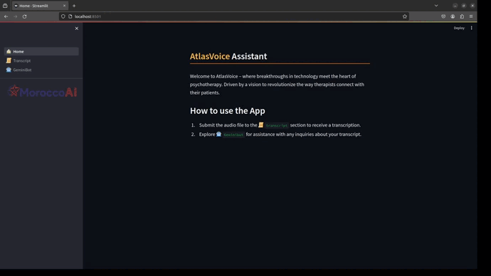

# AtlasVoice | MoroccoAI | 2023 GenAI Hackathon 

<p align="center">
  
</p>

## Description
**AtlasVoice** will assist psychotherapist doctors in understanding their patients and reducing the time spent on each recorded audio file.

**Problem:**
Psychotherapists often spend a significant amount of time listening to and analyzing recorded audio dialogues with their patients, which can be a time-consuming process.

**Solution:**
Develop a GenAI assistant, that utilizes speech recognition and NLP techniques to automatically transcribe, analyze, and summarize the recorded audio. The goal is to provide the psychotherapist with concise insights into the key elements of the conversation,

## What's new  
    Chatbot assitant reads your transcript, and help you solve your questions about the patient.


## Usage
To reproduce, run the following commands:

```
git clone https://github.com/achraf110/GenAI_Hackathon_AtlasVoice.git
```
```
cd GenAI_Hackathon_AtlasVoice
```
```
conda create -n atlas python=3.10
```
```
conda activate atlas
```

```
pip install -r requirements.txt 
```

```
streamlit run app.py
```

## License
Loading ...
